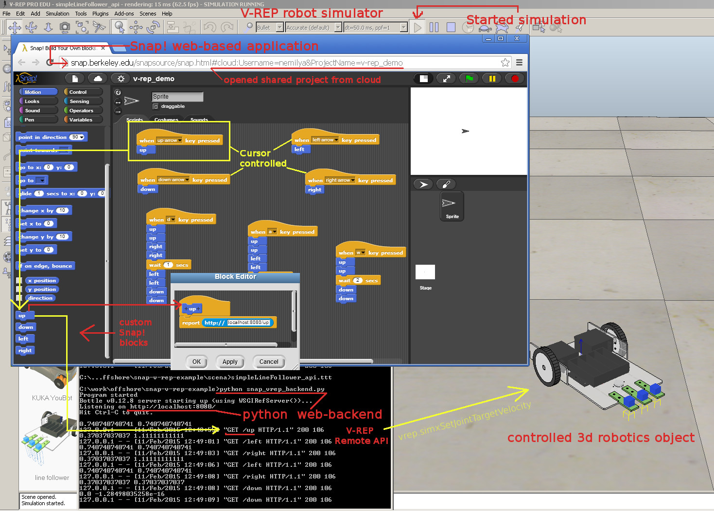

Snap! V-REP example
===================

This is simple "proof of concept" of controlling V-REP 3d robotics simulation world 
from Snap! web-based Scratch-like system.

[Open image in full-size](https://raw.githubusercontent.com/nemilya/snap-v-rep-example/master/snap-v-rep-example.jpg)

Files
-----

* `/scena` - folder with simple V-REP's scene
* `/views` - for html template for web-backend
* `.gitignore` - exclude some files
* `README.md` - this file
* `snap-v-rep-example.jpg` - screenshot with annotations
* `snap_vrep_backend.py` - web-backed for web API
* `v-rep_demo.xml` - Snap! demo project
* `remoteApi.dll` - files needed to work with V-REP API
* `vrep.py` - python wrapper for DLL
* `vrepConst.py` - constants for V-REP API

Files `remoteApi.dll`, `vrep.py` and `vrepConst.py` have to be taken from V-REP installation folder.

Install V-REP
-------------

Download from http://www.coppeliarobotics.com/downloads.html

Copy DLL for API
----------------

Copy 2 files (Python wrapper and constants for API) from folder `[Program Files]\V-REP3\V-REP_PRO_EDU\programming\remoteApiBindings\python\python`:

* `vrep.py`
* `vrepConst.py`

Copy `remoteApi.dll` from `[Program Files]\V-REP3\V-REP_PRO_EDU\programming\remoteApiBindings\lib\lib\`, folder (according to your machine 32/64bit architecture):

* `32Bit`
* `64Bit`

To current folder.

Install Python
--------------

* Python27 - from https://www.python.org/downloads/ [version 2.7.9]
* bottle

To install `bottle` in console:

    pip install bottle

`bottle` - is web framework.

Start V-REP
-----------

Open `scena/simpleLineFollower_api.ttt` file - starting V-REP.

Or Start V-REP and open from menu "File", "Open scene...".

`simpleLineFollower_api.ttt` is simple LineFollower (without Lua embedded script).

Start Simulation by press on "Play" button or from menu "Simulation", "Start simulation".

Start API backend
-----------------

In console:

    python snap_vrep_backend.py 

Bottle started at `8080` port.

Test API web control
--------------------

Open in browser URL:

* http://localhost:8080/up
* http://localhost:8080/down
* http://localhost:8080/left
* http://localhost:8080/right

See moving of LineFollower at V-REP. If not moving see section "Problems".

Start Snap!
-----------

Open demo Snap! application: http://snap.berkeley.edu/snapsource/snap.html#cloud:Username=nemilya&ProjectName=v-rep_demo

Or open: http://snap.berkeley.edu/snapsource/snap.html and Drag and drop file `v-rep_demo.xml` to browser.

Press curson up/down/left/right - see reaction of car at V-REP

Press "w", "a", "d" keys - see reaction of car at V-REP.

In Snap! was created custom blocks: "up", "down", "left", "right". Each block just call "Report" block, with URL request (to `http://localhost:8080/ACTION`).

Problems
--------

* Q: Car not moved? 
* A: Are you pressed "Play" button for start simulation at V-REP?

* Q: Python backent cant connect to `19997` port (in `snap_vrep_backend.py`)?
* A: See config `portIndex1_port` in `V-REP_PRO_EDU/remoteApiConnections.txt`
